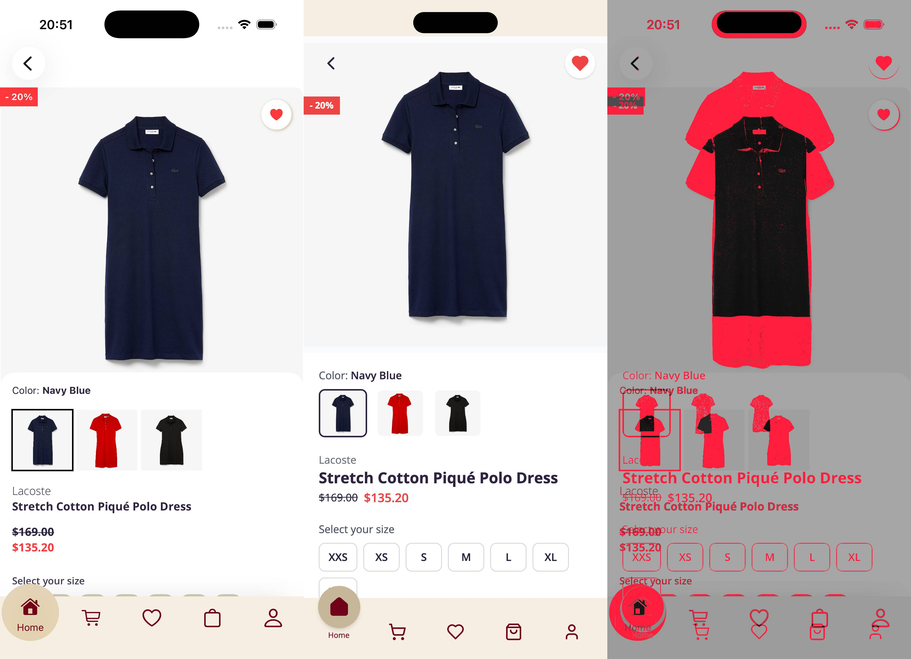
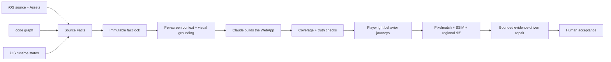

<h1 align="center">Grounded iOS-to-Web Harness</h1>

<p align="center">
  <strong>证据驱动的 iOS → Mobile WebApp 迁移与验收框架</strong><br>
  Evidence-grounded migration · behavior verification · critical-state visual regression
</p>

<p align="center">
  
  
  
  
  
</p>

## 这个项目是做什么的

把一个 iOS App 迁移成完整、可操作、手机尺寸的 WebApp，同时保留“为什么这样实现、如何证明没有漏、哪些地方仍有差异”的证据链。

Claude 负责理解和实现，Harness 不替 Claude 写页面，也不限制 React 架构。Harness 负责固定源 App 事实、准备生成前证据，并检查最终结果有没有漏页面、编造数据、行为错误或明显视觉偏差。

它不是另一个 UI 生成模型。它是一层轻量的 **grounding + verification harness**：让强大的编码 Agent 自由实现，同时用源码、运行状态、行为测试和视觉差异约束幻觉与漂移。

## Reference evaluation

仓库包含一个完整的 `ecommerce-main` WebApp 参考迁移和脱敏验收证据。源 iOS 工程未包含在仓库中。

| 维度 | 结果 |
| --- | --- |
| 锁定事实 | 19 Screens · 28 States · 19 Navigation contracts · 34 Actions |
| 核心旅程 | 3 条跨页面 Playwright 行为路径通过 |
| Web 自动检查 | 31 个 Screen/State 渲染与行为检查 + 10 个关键状态截图，共 41/41 通过 |
| 关键视觉 | 10 个同状态 iOS/Web 对比；Pixelmatch + SSIM + regional diff |
| Harness 回归测试 | 40/40 通过 |
| 最终决定 | 用户完成视觉审阅后接受；实验性自动分流仍标记 6 个状态建议复核 |

> 本项目不会把 SSIM 当成“还原度百分比”，也不会把人工接受伪装成像素级等价。完整证据见 [reference evaluation](docs/evidence/ecommerce-main/README.md)。



## 核心设计



这套设计借鉴了三条近期研究思路，但没有声称复现论文系统：

- [Coherence Debt](https://arxiv.org/abs/2608.16630)：编辑发生时保持依赖事实可用，并检查产物是否遵守这些事实；
- [WidgetGen](https://arxiv.org/abs/2608.12611)：用选择性的文字、颜色和布局证据改善直接 UI 代码生成，而不是建立沉重的固定 UI Schema；
- [WebDesignIter](https://arxiv.org/abs/2607.10621)：保存持续的设计知识，用局部修改和自动验证降低多轮仓库开发的回归。

## 你怎么使用

开始时只需要告诉 AI：

> 请使用 ios-web-harness，把 `<project-id>` 整个 iOS App 迁移成一个完整、统一、真实可操作的手机 WebApp。

完成后，打开 AI 提供的验证链接，决定接受还是继续调整。

## 完整流程

```text
你指定 iOS 项目或迁移范围
              ↓
1. 建立本次 Run
   本次事实、截图、测试和报告单独保存，不复用旧结果
              ↓
2. 发现源 App 事实
   静态源码 + codebase-memory + 必要的 iOS 实际运行
              ↓
3. 对账并锁定事实
   Screen / State / Action / Navigation / Flow / Data / Asset
   每屏呈现方式、每次操作的数据/导航结果都有源码或运行证据
   state-snapshots.json 固定 iOS/Web 共用的用户、数据和选中状态
              ↓
4. 采集关键 iOS 状态
   在模拟器中进入关键页面和状态，保存真实截图
              ↓
5. 生成“编码前视觉依据”
   从 iOS 截图提取文字与位置、颜色、画布尺寸、截图哈希，
   再关联源码事实和原始 Assets，供 Claude 写第一版时参考
              ↓
6. Claude 自主生成完整 WebApp
   Claude 自己决定 React 组件、状态管理和 CSS
              ↓
7. 真实性与完整性检查
   检查页面/状态有没有遗漏，数据和图片是否有来源，
   是否存在占位图、假数据、截图背景或桌面网页越出手机壳
              ↓
8. 行为检查
   Playwright 真实点击、输入和跳转；测试预期必须引用锁定的 ACTION 事实
              ↓
9. 生成后的 VRT
   将相同状态下的 iOS 与 Web 截图放到同一画布，
   使用 Pixelmatch + SSIM 生成差异指标和 Diff 图
              ↓
10. 最多两轮证据驱动精修
    只根据真实性、行为和视觉证据修复，避免无限循环
              ↓
AUTO_COMPLETE 或 NEEDS_REVISION
              ↓
你打开 WebApp，最终决定是否 USER_ACCEPTED
```

## VRT 在哪里

视觉能力分为前后两个环节，它们不是同一件事：

| 环节 | 时间 | 作用 |
| --- | --- | --- |
| 编码前视觉依据 | Claude 写 WebApp 之前 | 把 iOS 截图转成可用的文字位置、颜色、尺寸和 Asset 证据，减少 Claude 凭感觉设计 |
| VRT（视觉回归测试） | WebApp 第一版完成之后 | 对比相同状态的 iOS/Web 截图，用 Pixelmatch、SSIM 和 Diff 图找出实际差异 |

完整闭环是：

```text
iOS 源码与 Assets 告诉我们“内容和逻辑应该是什么”
                    +
iOS 运行截图告诉 Claude“第一版应该长什么样”
                    ↓
              Claude 生成 WebApp
                    ↓
VRT 检查“实际做出来以后，与原 App 相差多少”；整图和局部差异同时分流
```

VRT 不是让 Claude 只看图猜页面，也不允许把 iOS 截图直接当成 Web 背景。

## 研究思路和工具分别做什么

这里需要先区分三类东西：

| 类型 | 内容 |
| --- | --- |
| 研究提出的问题或方法 | Coherence Debt、WidgetGen、WebDesignIter |
| 实际调用的成熟工具 | codebase-memory-mcp、Maestro、Tesseract、Playwright、Pixelmatch、SSIM |
| Harness 自己的轻量连接层 | `source-facts`、`truth-map`、`state-snapshots`、`facts-lock`、`context`、`checkpoint` |

Harness 没有把三篇论文的完整研究系统复制进来，而是只采用与 iOS→Web 迁移直接相关、ROI 较高的部分。

### Coherence Debt：防止 Claude 在长任务中忘记或混淆事实

[Coherence Debt](https://arxiv.org/abs/2608.16630) 不是一个软件，而是一个问题名称，可以理解为“上下文一致性债务”。

完整 App 涉及很多互相依赖的事实，例如：

```text
商品详情按钮的行为
        ↕
购物车状态
        ↕
页面路由
        ↕
Playwright 测试预期
        ↕
Checkout 商品和价格
```

如果 Claude 修改商品详情时没有同时看到正确的导航事实，它可能会猜测“加入购物车后跳转到购物车”。代码、路由和测试可以彼此一致，但它们可能一起偏离 iOS，这正是本轮发现的问题。

Harness 用下面几层减少 Coherence Debt：

| Harness 机制 | 作用 |
| --- | --- |
| `source-facts.json` | 保存页面、状态、行为和来源证据 |
| `truth-map.json` | 保存数据与 Assets 的真实来源，防止编造 |
| `state-snapshots.json` | 固定 iOS 与 Web 使用的同一用户、记录、地址、选中项和金额 |
| `facts-lock` | 锁定当前事实版本，修改事实必须留下 revision |
| `contexts/*.json` | 每次只给 Claude 当前页面所需的事实，不反复塞入整仓资料 |
| Context 哈希 | 事实、视觉计划或 Data/Asset 来源变化后，旧 context 自动失效 |
| `checkpoint` | 记录首版和修复版所依据的事实版本及 Web 内容哈希 |

它解决的是“正确事实已经存在，但 Agent 编码时没有看到、看到旧版或跨文件失去一致性”。

它不能自动判断“最开始提取的证据是否真实”。因此 Harness 会拒绝占位事实，要求核心动作记录前置条件、数据效果、导航效果和可见反馈，并要求关键视觉状态绑定同一份状态快照；证据本身仍要由源码、codebase-memory 和 iOS 运行共同提供。

### WidgetGen：在 Claude 编码前提供轻量视觉证据

[WidgetGen](https://arxiv.org/abs/2608.12611) 研究的是如何在“直接让多模态模型看图写代码”和“建立很重的固定 UI Schema”之间取得平衡。

它的核心启发是：

```text
不只把截图扔给模型
        ↓
先提取少量客观、可复用的视觉证据
        ↓
仍然让模型直接生成代码
```

Harness 在第 4～6 步借鉴了这个思路：

| WidgetGen 启发 | Harness 当前实现 |
| --- | --- |
| 提取可见文字 | Tesseract OCR 提取文字和位置框 |
| 提取颜色证据 | 记录主要颜色及覆盖比例 |
| 固定画布 | 记录 iOS 截图宽高和截图哈希 |
| 使用真实资源 | 把相关 iOS Assets 和源码事实放入页面 context |
| 不使用过重 UI Schema | 不生成固定 Widget Tree，不规定 React 组件结构 |
| 直接生成代码 | Claude 根据页面 context 自主编写 React、状态管理和 CSS |

因此 WidgetGen 思路主要作用于“Claude 第一版生成之前”，目的是减少凭感觉改颜色、排版、文字和图片。

当前项目没有安装或运行论文中的完整 WidgetGen，也没有使用它的专用模型、完整布局推理或图表推理。仓库中的 `scripts/visual_grounding.mjs` 是面向本项目的轻量实现，只提取 OCR、颜色、尺寸、截图身份和关联 Assets。

### WebDesignIter：让首版和修复过程共享同一套事实

[WebDesignIter](https://arxiv.org/abs/2607.10621) 关注的是仓库级前端开发：代码经过多轮修改后，Agent 容易忘记架构、模块职责和历史设计决定，从而引入回归。

它提出的关键方向是：

```text
持久设计知识
        ↓
依据知识规划修改
        ↓
只修改相关位置
        ↓
运行测试验证
        ↓
把新状态继续保存
```

Harness 在第 3、6、8、9、10 步借鉴了其中的轻量部分：

| WebDesignIter 启发 | Harness 当前实现 |
| --- | --- |
| 保留持久知识 | 锁定的 Source Facts、Truth Map、页面 Context |
| 利用代码关系 | codebase-memory-mcp 查找 iOS 页面、入口、子组件和依赖 |
| 面向局部修改 | 一个 Screen 使用一个小 context，精修依据具体行为或 Diff 证据 |
| 自动验证 | Playwright、移动壳检查、真实性检查和 VRT |
| 多轮一致性 | `first-pass` 与最多两次 `repair` checkpoint |

当前项目没有安装 WebDesignIter，也没有实现论文中的 WebAppArchKG、自动设计规划器或完整的 diff-based 代码生成系统。codebase-memory 目前主要分析源 iOS 项目；Harness 用 JSON 事实锁和 checkpoint 保存迁移知识，保持实现轻量。

### dsh-anchored-standard：控制上下文和工具数量的参考

[dsh-anchored-standard](https://github.com/xiaobright/dsh-anchored-standard) 研究模型在会话开始时会受到工具列表、自动注入上下文和初始轨迹的影响。它采用先保持很小的工具与上下文，再逐步开放能力的两阶段方式。

我们没有安装它，也没有改变 Claude 的工具系统。Harness 只借鉴了一个原则：

> 不要在每次编码时把整仓文档、所有工具说明和所有页面事实一起塞给 Claude。

因此 Harness 使用：

- 一个页面一份小型 `contexts/*.json`；
- 只把该页面相关的源码、状态、Data、Asset 和视觉依据交给 Claude；
- 需要时再用 codebase-memory 获取依赖；
- 不自动启动多个 Agent 或 Codex review—修复循环。

这减少上下文噪声，但不会限制 Claude 选择 React 架构或实现方式。dsh-anchored-standard 的 DeepSeek 两阶段工具启动机制不属于当前 Harness。

## 实际工具在流程中的位置

| 工具 | 位于哪一步 | 实际作用 | 不负责什么 |
| --- | --- | --- | --- |
| 静态源码扫描 | 2 | 找候选页面、状态声明、Model、Service 和 Assets | 不能单独证明运行时页面一定可达 |
| codebase-memory-mcp | 2、3、6 | 从 App 入口追踪页面、导航、子组件和依赖；编码时补充局部关系 | 不负责截图，不自动证明 UI 长什么样 |
| Maestro | 4、9 | 在 iOS 模拟器中执行 Flow、进入关键状态并截图 | 不能保证自动发现并点击所有未知页面 |
| Tesseract | 5 | 从 iOS 截图提取文字和文字位置 | 不理解业务逻辑，也不负责生成页面 |
| iOS Assets | 3、5、6 | 提供原始商品图、图标和视觉资源 | 不能说明按钮点击后的行为 |
| Claude | 2、6、10 | 整理证据、实现完整 WebApp，并依据证据精修 | 不允许创造无来源的源 App 事实 |
| Playwright | 7、8、9 | 检查所有页面基础渲染、执行核心 Web 行为、生成 Web 截图 | 只有测试预期正确时才能验证正确行为 |
| Pixelmatch | 9 | 标出 iOS/Web 对应像素变化，生成 Diff 图和变化比例 | 不能判断变化是否符合业务含义 |
| SSIM | 9 | 从整体结构角度衡量两张截图的相似程度 | 不是“还原度百分比”，不能检查数据和交互 |
| Harness | 全流程 | 把事实、上下文、工具证据、检查结果和轮次连接起来 | 不是新的 UI 生成模型，也不替代 Claude |

## 这些方法如何组成一个闭环

```text
静态扫描 + codebase-memory + iOS 运行
                ↓
        找到并对账源事实
                ↓
Coherence Debt 机制：锁定事实并生成每屏小 context
                ↓
WidgetGen 思路：把关键截图转成轻量视觉依据
                ↓
        Claude 自由生成完整 WebApp
                ↓
WebDesignIter 思路：按证据检查和局部修复
                ↓
Playwright 验行为 + Pixelmatch/SSIM 验关键视觉
                ↓
       最多两轮修复后交给用户
```

## 每种页面怎么验收

| 范围 | 验收方式 |
| --- | --- |
| 所有用户可见 Screen + State | 页面能打开、不是空白、关键内容存在、图片正常、无严重浏览器错误 |
| 少量核心用户流程 | Playwright 真实点击、输入、跳转并检查结果；交互步骤引用锁定 ACTION 事实 |
| Critical Visual Set | 按 `state-snapshots.json` 建立同一 iOS/Web 状态后执行 VRT；核心状态型页面同时覆盖空和有数据 |

VRT 只用于关键或高风险状态，不是每个普通页面都做昂贵的像素对比。其他页面仍必须通过基础渲染和完整性检查。

## Harness 当前能保证什么

- 依据源码、codebase-memory、运行证据和 Assets 整理源 App 事实；
- 按 `Screen + State` 检查页面和状态覆盖；
- 锁定每屏呈现方式以及核心动作的数据、导航和可见反馈；
- 让关键 iOS/Web 证据绑定同一份状态快照；
- 检查图片、文字和业务数据是否具有来源；
- 使用 Playwright 验证核心交互；
- 使用生成前视觉依据提高 Claude 第一版还原度；
- 使用 Pixelmatch、SSIM 和 Diff 图检查关键页面视觉差异；
- 最多允许两轮证据驱动精修；
- 自动检查使用当前工作区的独占服务和本次 Run 新证据。

## 当前仍不能完全保证什么

- 自动发现不等于数学意义上的 100% 不漏页面或状态；
- 无法证明输入证据本身绝对完整；如果源码分析和运行采集同时遗漏隐藏状态，仍要发现后修订事实锁；
- VRT 指标只能发现视觉差异，不能证明业务逻辑和数据正确；
- `AUTO_COMPLETE` 只表示自动规则通过，不等于用户已经接受。

因此，最终验收仍由你打开 WebApp 完成。

## 输出在哪里

| 内容 | 位置 |
| --- | --- |
| 生成的 WebApp | `webapps/<project-id>/` |
| 本次事实、截图和报告 | `.runs/<project-id>/<run-id>/` |
| 项目与功能蓝图 | `docs/项目/<project-id>/项目蓝图.md` |
| 可点击链接和启动方法 | `docs/WebApp查看清单.md` |
| AI 接手当前任务的信息 | `.planning/HANDOFF.md` |

## 自动状态

| 状态 | 含义 |
| --- | --- |
| `AUTO_COMPLETE` | 自动覆盖、真实性、行为和关键视觉检查达到当前规则要求 |
| `NEEDS_REVISION` | 仍有事实、页面、行为、数据或视觉问题 |
| `USER_ACCEPTED` | 用户实际打开 WebApp 并接受结果 |

## 进一步查看

日常只需阅读本 README 和 [WebApp 查看清单](docs/WebApp查看清单.md)。需要了解实现细节时再阅读：

- [技术方案](docs/项目技术方案.md)
- [项目与功能清单](docs/项目清单.md)
