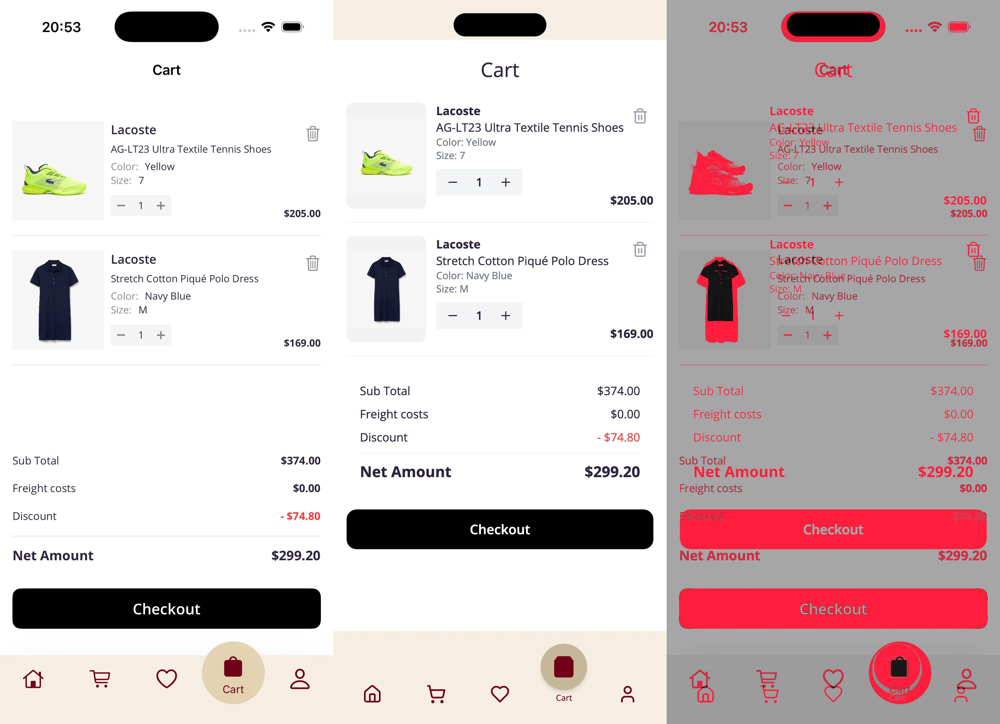
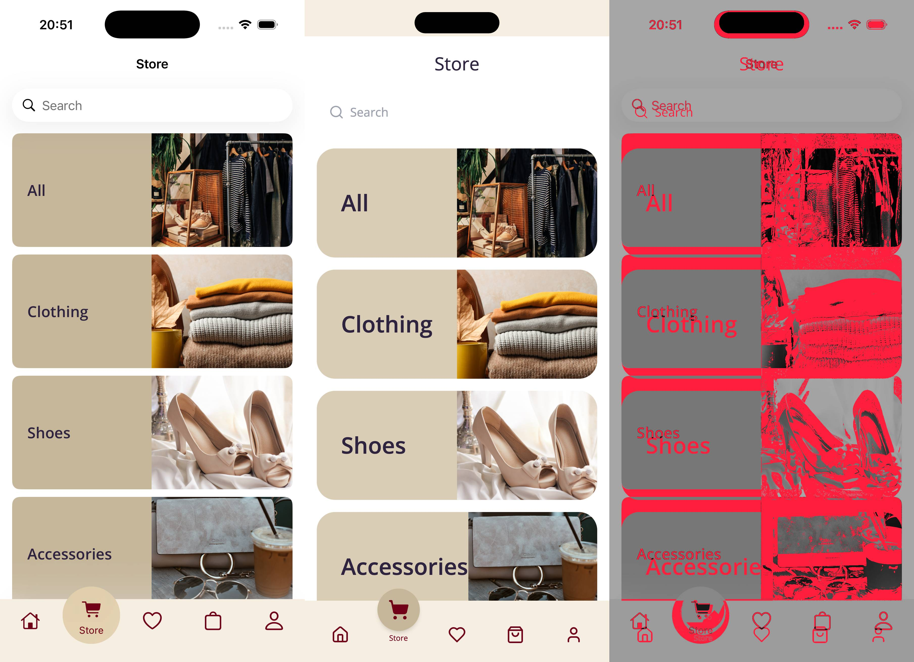

# ecommerce-main Reference Evaluation

这是 `Grounded iOS-to-Web Harness` 的参考迁移证据卡。它保存精选结果，不包含源 iOS 工程、账号、私有 MCP 配置或完整临时 Run。

## 结论

| 项目 | 结果 |
| --- | --- |
| Run | `20260826-200915-full-app` |
| 事实覆盖 | 19 Screens · 28 States · 19 Navigation contracts · 34 Actions |
| 核心行为 | 3 条 Playwright 跨页面旅程通过 |
| Web 自动检查 | 41/41 通过（行为、渲染和关键状态截图） |
| 关键视觉 | 10 个状态完成 Pixelmatch、SSIM 和局部差异分析 |
| 自动状态 | `NEEDS_REVISION`：6 个状态建议人工视觉复核 |
| 用户决定 | `USER_ACCEPTED`：用户查看定向精修结果后接受 |

自动状态与用户决定被刻意分开：实验性视觉指标用于暴露风险，不等价于“还原度百分比”；用户接受也不会覆盖或删除原始差异记录。

## 视觉指标

| State | Changed ratio | SSIM | Max region | Triage |
| --- | ---: | ---: | ---: | --- |
| `home-view-default` | 0.2889 | 0.3744 | 0.7132 | Review |
| `store-view-default` | 0.2869 | 0.4343 | 0.7158 | Review |
| `products-list-view-category` | 0.1760 | 0.4582 | 0.4807 | Review |
| `product-detail-view-default` | 0.1312 | 0.6282 | 0.5097 | Review |
| `favorites-view-empty` | 0.0393 | 0.8019 | 0.1849 | No automatic flag |
| `favorites-view-with-items` | 0.1716 | 0.5294 | 0.5202 | Review |
| `cart-view-empty` | 0.0368 | 0.8157 | 0.2664 | No automatic flag |
| `cart-view-with-items` | 0.1502 | 0.5168 | 0.4994 | Review |
| `checkout-view-no-address` | 0.1049 | 0.6514 | 0.3955 | No automatic flag |
| `profile-view-default` | 0.0500 | 0.6633 | 0.3416 | No automatic flag |

当前 v0.x 分流信号为：`changed_ratio ≥ 0.20`、`SSIM ≤ 0.60` 或 `max_region ≥ 0.40`。这些数值只推荐复核，不是永久发布阈值。

## 精选对比

每张图从左到右为 iOS、Web 和差异可视化。

### Product detail


### Cart with items



### Store



其余对比图位于 [`visual/`](visual/)。机器可读汇总见 [`result.json`](result.json)，修复轮身份记录见 [`work-cycle.json`](work-cycle.json)。

## 可复现检查

```bash
# Harness 回归测试
npm install
npm test

# 参考 WebApp
cd webapps/ecommerce-main
npm install
npm run build
npm run lint
npm test
```

完整 iOS↔Web 重放需要用户自行提供有权使用的 iOS 工程、Xcode/Simulator、Maestro 和对应运行状态。仓库没有分发参考 iOS 源码。
